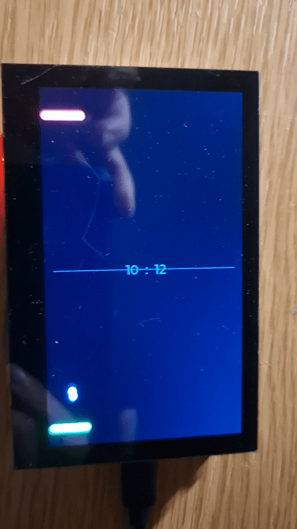

# 🏓 ESP32-S3 Portrait Pong

A high-speed, vertical Pong clone designed specifically for the **Waveshare ESP32-S3-Touch-LCD-4.3**.

This project demonstrates how to handle 2D game physics, touch input mapping, and high-performance rendering using LVGL on the ESP32-S3, achieving a smooth ~30 FPS without screen tearing.



## 🎮 Features

* **Vertical Gameplay:** Optimized for the 480x800 Portrait orientation.
* **Smart Touch Control:** "Drag Anywhere" input. You don't need to cover the paddle with your finger; dragging anywhere on the screen controls the player paddle.
* **Simple AI:** An automated opponent tracks the ball with adjustable difficulty settings.
* **Smooth Physics:** Dedicated timer-based physics loop running independently of the rendering loop.
* **Neon Aesthetics:** High-contrast visuals (Black BG, Neon Green Player, Neon Red AI).

## 🛠 Hardware Requirements

* **Board:** [Waveshare ESP32-S3-Touch-LCD-4.3](https://www.waveshare.com/wiki/ESP32-S3-Touch-LCD-4.3) (480x800 RGB Interface).
* **Power:** USB-C.

## 📦 Software Dependencies

This project relies on the **Espressif Display Panel** framework. Ensure you have the following installed in Arduino IDE:

1.  **ESP32_Display_Panel** (by Espressif Systems)
2.  **ESP32_IO_Expander** (by Espressif Systems)
3.  **lvgl** (v8.3.x or 8.4.0)
4.  **ESP32 Board Definition:** `v2.0.17` (Recommended) or `v3.0.x`.

## 📂 Project Structure

Your sketch folder must contain these specific configuration files to match the Waveshare hardware:

* `Portrait_Pong.ino`: The main game logic.
* `esp_panel_board_custom_conf.h`: Defines the specific RGB timing and pinout for this board.
* `lvgl_v8_port.h` & `.cpp`: Handles the LVGL buffer flushing and task management.

## ⚙️ Critical Configuration

To prevent screen flickering and ensure touch inputs align with the vertical screen, you must configure `lvgl_v8_port.h` exactly as follows:

```cpp
// In lvgl_v8_port.h

// 1. Use Partial Refresh (Mode 0) for stable performance
#define LVGL_PORT_AVOID_TEARING_MODE      (0)

// 2. Rotate the Touch Input 90 degrees to match Portrait orientation
#define LVGL_PORT_ROTATION_DEGREE         (90)